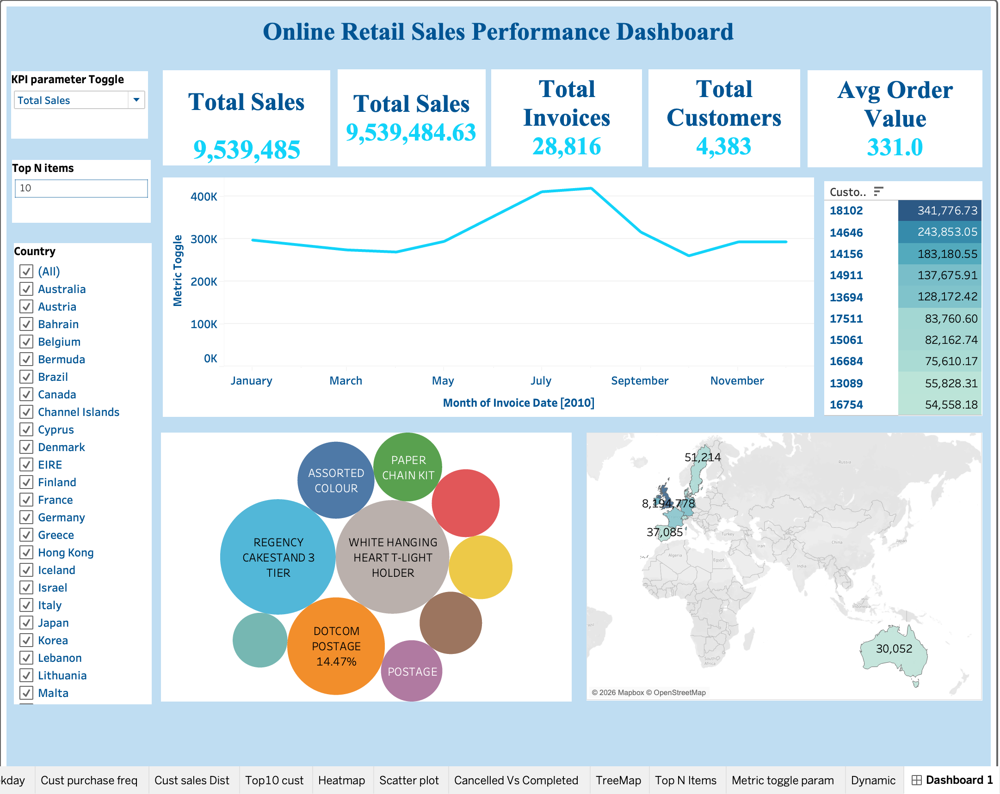
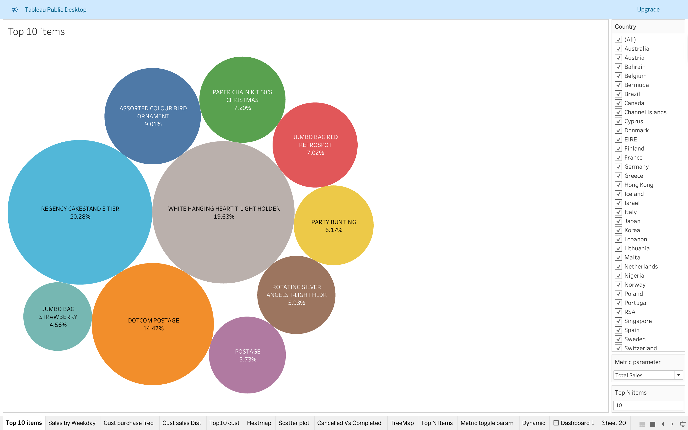
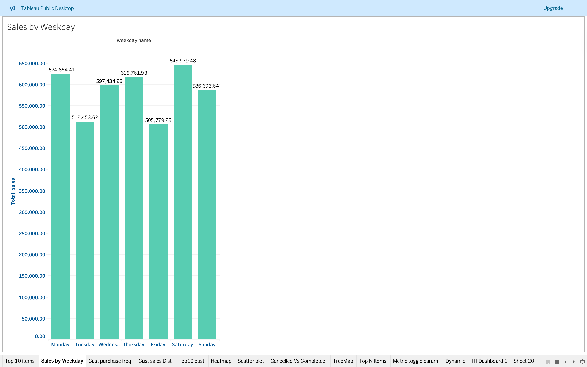
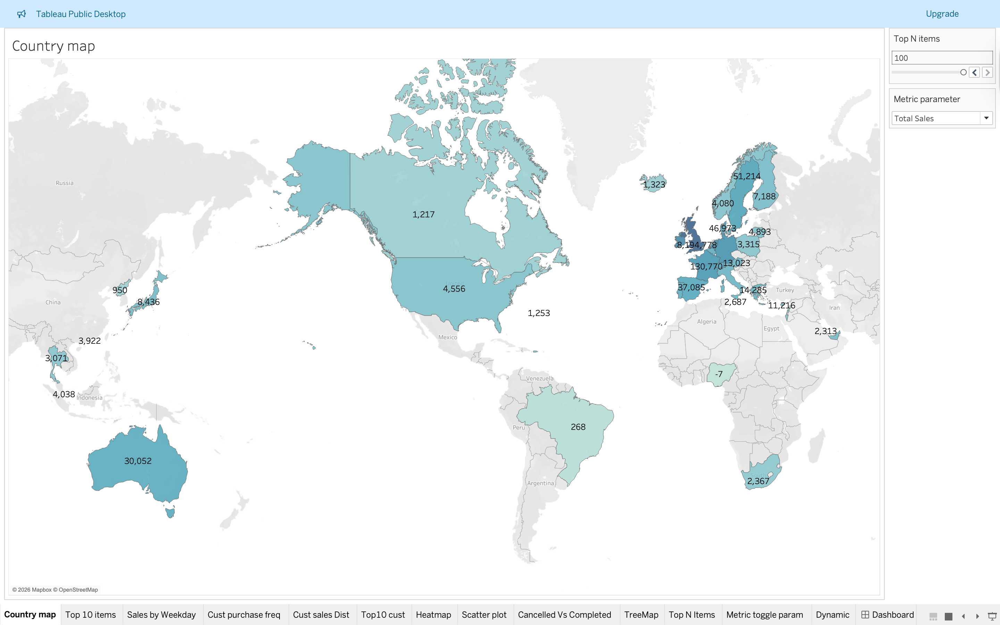

# Online Retail Sales Dashboard (Tableau)

## Overview
This project presents an interactive Tableau dashboard analyzing online retail sales data to track KPIs, trends, and customer behavior.

## Tools Used
- Tableau
- Data Visualization
- Dashboard Design

## Key Insights
- Sales trends over time
- Top-performing products
- Customer purchase behavior
- Regional sales distribution

## Project File
- sales_dashboard.twbx

## Dashboard Preview

## Outcome
Created an interactive dashboard to support business decision-making through visual insights.
